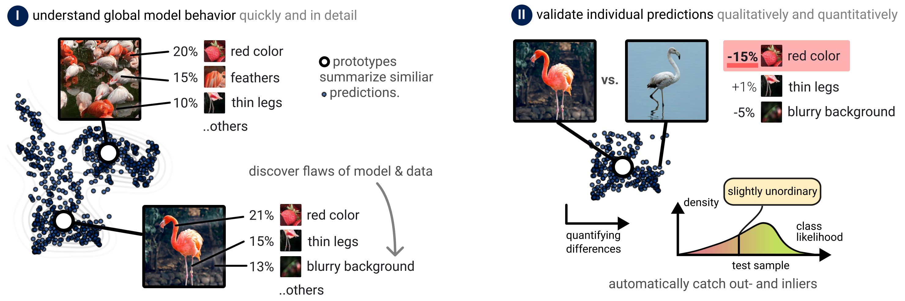

<div align="center">

<h1>Prototypical Concept-based Explanations (PCX)</h1>
<p>
PyTorch Implementation</p>
</div>


## Description

This repository contains the code for the paper "**[Understanding the (Extra-)Ordinary: Validating Deep Model Decisions with Prototypical Concept-based Explanations](https://arxiv.org/pdf/2311.16681)**''.

<div align="center">

</div>
<i>Credits for images: pexels.com</i>


Check out our project page **[here](https://maxdreyer.github.io/pcx/)**.

## Note
We provide the code for all experiments **[here](https://drive.google.com/file/d/17d3UfYFCBnfqNKcxSCeNbTnrO7amdpzo)**.

However, our aim for **this** repository is to provide an implementation that is as easy as possible, which we are currently working on.

### Abstract 

Ensuring both transparency and safety is critical when deploying Deep Neural Networks (DNNs) in high-risk applications, such as medicine. The field of explainable AI (XAI) has proposed various methods to comprehend the decision-making processes of opaque DNNs. However, only few XAI methods are suitable of ensuring safety in practice as they heavily rely on repeated labor-intensive and possibly biased human assessment. In this work, we present a novel post-hoc concept-based XAI framework that conveys besides instance-wise (local) also class-wise (global) decision-making strategies via prototypes. What sets our approach apart is the combination of local and global strategies, enabling a clearer understanding of the (dis-)similarities in model decisions compared to the expected (prototypical) concept use, ultimately reducing the dependence on human long-term assessment. Quantifying the deviation from prototypical behavior not only allows to associate predictions with specific model sub-strategies but also to detect outlier behavior. As such, our approach constitutes an intuitive and explainable tool for model validation. We demonstrate the effectiveness of our approach in identifying out-of-distribution samples, spurious model behavior and data quality issues across three datasets (ImageNet, CUB-200, and CIFAR-10) utilizing VGG, ResNet, and EfficientNet architectures.

## Tutorial

We provide a tutorial on how to use the PCX framework on the ImageNet flamingo class.
The tutorial is divided into the following steps:

1. [Installation](#installation)
2. [Concept-based Explanations](#concept-based-explanations)
3. [Prototypical Concept-based Explanations](#prototypical-concept-based-explanations)

### Installation

First, clone the repository and install the required packages:

```bash
pip install -r requirements.txt
```

Note: We use python 3.8.10 for this tutorial.

Secondly, unzip the flamingo data samples that were retrieved from pexels.com:

```bash
unzip datasets/pexels/pexels_imgs.zip -d datasets/pexels/
```

### Concept-based Explanations

To generate concept-based explanations using the [CRP](https://github.com/rachtibat/zennit-crp) package for the ImageNet flamingo class, please run the following Jupyter notebook called `tutorial_0_concept_explanation.ipynb`.

### Prototypical Concept-based Explanations

To generate prototypical concept-based explanations for the ImageNet flamingo class, please run the following Jupyter notebook called `tutorial_1_pcx_explanation.ipynb`.


## Full Code for Paper
We provide the code for all experiments in the paper **[here](https://drive.google.com/file/d/17d3UfYFCBnfqNKcxSCeNbTnrO7amdpzo)**.

## Citation

Please feel free to cite our work, if used in your research:

```bibtex
@inproceedings{dreyer2024understanding,
  author={Dreyer, Maximilian and Achtibat, Reduan and Samek, Wojciech and Lapuschkin, Sebastian},
  booktitle={2024 IEEE/CVF Conference on Computer Vision and Pattern Recognition Workshops (CVPRW)}, 
  title={Understanding the (Extra-)Ordinary: Validating Deep Model Decisions with Prototypical Concept-based Explanations}, 
  year={2024},
  volume={},
  number={},
  pages={3491-3501},
  doi={10.1109/CVPRW63382.2024.00353}}
```
